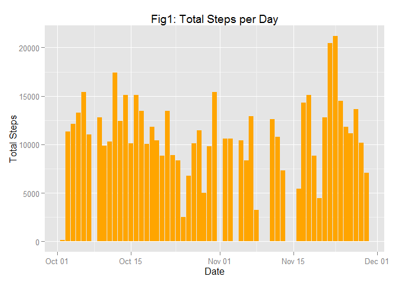
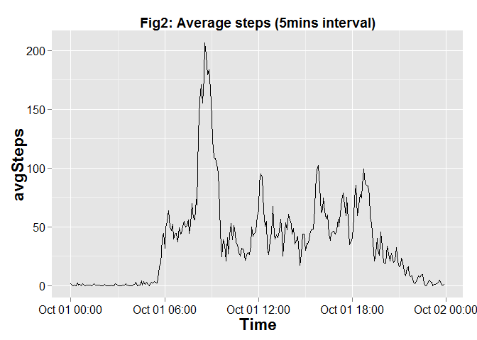
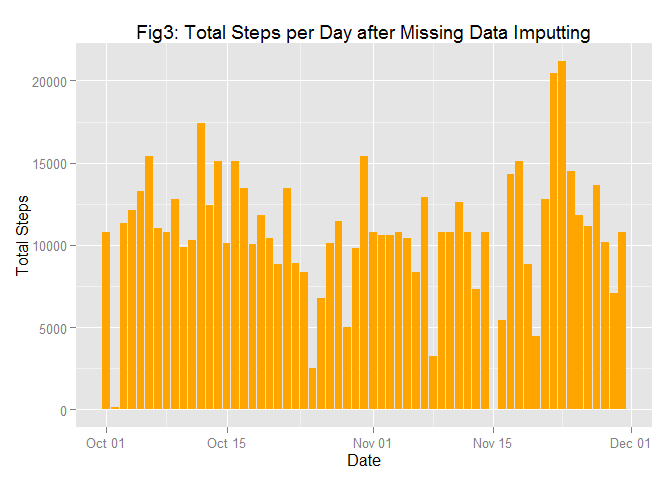
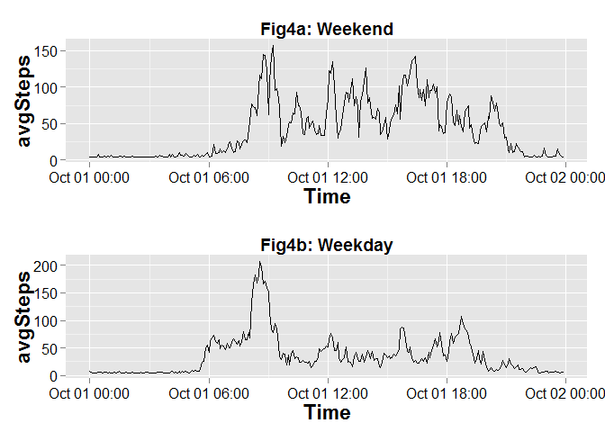

# PA1_template
CJ  
Saturday, December 13, 2014  

## 1. Introduction

It is now possible to collect a large amount of data about personal
movement using activity monitoring devices such as a
[Fitbit](http://www.fitbit.com), [Nike
Fuelband](http://www.nike.com/us/en_us/c/nikeplus-fuelband), or
[Jawbone Up](https://jawbone.com/up). These type of devices are part of
the "quantified self" movement -- a group of enthusiasts who take
measurements about themselves regularly to improve their health, to
find patterns in their behavior, or because they are tech geeks. But
these data remain under-utilized both because the raw data are hard to
obtain and there is a lack of statistical methods and software for
processing and interpreting the data.


  
## 2. Analysis

### 2.1 Data

This assignment makes use of data from a personal activity monitoring
device. This device collects data at 5 minute intervals through out the
day. The data consists of two months of data from an anonymous
individual collected during the months of October and November, 2012
and include the number of steps taken in 5 minute intervals each day.
The data for this assignment can be downloaded from the course web site:

* Dataset: [Activity monitoring data ](https://d396qusza40orc.cloudfront.net/repdata%2Fdata%2Factivity.zip)[52K]

The variables included in this dataset are:

* **steps**: Number of steps taking in a 5-minute interval (missing values are coded as NA)

* **date** : The date on which the measurement was taken in YYYY-MM-DD format

* **interval**: Identifier for the 5-minute interval in which measurement was taken

The dataset is stored in a comma-separated-value (CSV) file and there are a total of 17,568 observations in this dataset.

Load and preview data 


```r
library(data.table)
act <- data.table(read.csv("D:/GitHub/datasciencecoursera/Repro/data/activity.csv"))
head(act, n=3)
tail(act, n=3)
names(act)
```

```
##    steps       date interval
## 1:    NA 2012-10-01        0
## 2:    NA 2012-10-01        5
## 3:    NA 2012-10-01       10
##    steps       date interval
## 1:    NA 2012-11-30     2345
## 2:    NA 2012-11-30     2350
## 3:    NA 2012-11-30     2355
## [1] "steps"    "date"     "interval"
```
 
### 2.2 Daily activity 

In this section, we preform our analysis on the activity data both at daily basis and 5-minute basis. Here,we ignore the missing values in the database. Another analysis after imputing missing data would be performed in next section.


#### Steps per day

What's the overall profile of data on daily basis? To address this question, we could Make a histogram of the total number of steps taken each day.  


```r
stepsPerDay=act[,sum(steps, ra.rm=TRUE), by=date]
stepsPerDay$date <- as.Date(stepsPerDay$date, "%Y-%m-%d")
setnames(stepsPerDay,"V1", "totalSteps")
names(stepsPerDay)

# histogram 

library(ggplot2)
Sys.setlocale("LC_TIME", "English")
ggplot(stepsPerDay, aes(x=date, y=totalSteps)) +
    geom_bar(fill="orange", stat="identity") +
    labs(x="Date", y="Total Steps", title="Fig1: Total Steps per Day")
```

 

```
## [1] "date"       "totalSteps"
## [1] "English_United States.1252"
```

Now we calculate the mean and median total number of steps taken per day ignoring missing values.


```r
mean(stepsPerDay$totalSteps, na.rm=TRUE)
median(stepsPerDay$totalSteps,na.rm=TRUE)
```

```
## [1] 10767.19
## [1] 10766
```
As shown in **Fig1**, the total steps per day among Oct01- Dec01 seems to be equally distributed among its mean and median. It suggests that it might be possible to detect the irregular activity by activity analysis on daily basis. 

#### Average daily activity patter

Another way to study the activity data is to analysis its average daily activity patter. First, we make a time series plot of the 5-minute interval and the average number of steps taken averaged across all days. 


```r
# create a time seqence
start <- as.POSIXct(act$date[[1]], )
interval <- 5
end <- start + as.difftime(1, units="days")
TimeSeq<-seq(from=start, by=interval*60, to=end)

# average steps for each interval 
library(plyr)
stepsPerInterval <- ddply(act, .(interval), summarize, avgSteps=mean(steps, na.rm=TRUE))
stepsPerInterval<-cbind(stepsPerInterval, timeSeq=TimeSeq[1:288])


maxstepsPerInterval <- stepsPerInterval$timeSeq[which.max(stepsPerInterval$avgSteps)]
stepsPerInterval$avgSteps[which.max(stepsPerInterval$avgSteps)]
strftime(maxstepsPerInterval, format="%H:%M:%S")


ggplot(stepsPerInterval, aes(x=TimeSeq[1:288], y=avgSteps)) +
    xlab("Time")+
    geom_line()+
    ggtitle("Fig2: Average steps (5mins interval)")+
    theme(plot.title = element_text(lineheight=0.8, face=quote(bold)))+
    theme(axis.text.x = element_text(size=12, colour = rgb(0,0,0)))+
    theme(axis.text.y = element_text(size=12, colour = rgb(0,0,0)))+
    theme(axis.title.y = element_text(size=17,  face=quote(bold), colour = rgb(0,0,0)))+
    theme(axis.title.x = element_text(size=17,  face=quote(bold), colour = rgb(0,0,0)))
```

 

```
## [1] 206.1698
## [1] "08:35:00"
```

As we can see from **Fig2**, `8:35am` contains the maximum number steps (`206` steps averaging across all the days in the dataset). This may be due to a regular exercise, walking to work or others. Assuming a average step size of a man is 0.7m, 200 steps per 5-minute would be at about 1.6 km/h, which is much slower than the regular running and also a regular walking without a pack. Hence, one plausible explanation is that the peak in **Fig2** from 8:00 am to 9:00 am might be due to a slow walking with a pack. 


### 2.3 Missing Values

Note that there are a number of days/intervals where there are missing values (coded as NA). The presence of missing days may introduce bias into some calculations or summaries of the data. We calculate the total number of missing values in the data set. For example, the total number of rows with `NAs`.


```r
sum(is.na(act$steps),na.rm=FALSE)
sum(is.na(act$steps),na.rm=FALSE)/nrow(act) 
```

```
## [1] 2304
## [1] 0.1311475
```
In total, we have 13% observation contains missing values. A strategy for filling in all the missing values in the dataset may help to reduce the bais inside the data. Two simple strategy are proposed here. We could use the mean/median for that day, or the mean for that 5 minute interval. Here we prefered use the mean for 5-minute interval. The reasons are following. As mentioned above, the total steps per day seems equally distributed around its mean/median, which is 10000 steps per day by average. Therefore, around 35 steps on 5-minte basis. However, as shown in **Fig2**, average steps at 5-minute interval broadly distributed from 0 to 200 steps. Hence, if the `NAs` are not randomly distributed in different time interval. In other words, `NAs` occur more in a specific period. We may distort 5-minute profile if we imputing missing values using mean/median for that day. Therefore, here we use the mean for 5-minute interval for filling in all of the missing values in the dataset. 

```r
# 3. Create a new dataset that is equal to the original dataset but with the missing data filled in.
MisRemovedAct <- act
# use mean for that 5-minute interval 
MisRemovedAct$steps[is.na(MisRemovedAct$steps)] <- mean(MisRemovedAct$steps, na.rm= TRUE)

# report the mean and median total number of steps taken per day
stepsPerDayNew=MisRemovedAct[,sum(steps, ra.rm=TRUE), by=date]
stepsPerDayNew$date <- as.Date(stepsPerDayNew$date, "%Y-%m-%d")
setnames(stepsPerDayNew,"V1", "totalSteps")
names(stepsPerDayNew)

# compare with the one before filling
cat("new mean:",mean(stepsPerDayNew$totalSteps))
cat("\t\told mean:",mean(stepsPerDay$totalSteps,na.rm=TRUE))
cat("\nnew median:", median(stepsPerDayNew$totalSteps))
cat("\t\told median: ", median(stepsPerDay$totalSteps,na.rm=TRUE))

# make a histogram of the total number of steps taken each day and Calculate 
library(ggplot2)
ggplot(stepsPerDayNew, aes(x=date, y=totalSteps)) +
        geom_bar(fill="orange", stat="identity") +
        labs(x="Date", y="Total Steps", title="Fig3: Total Steps per Day after Missing Data Imputting")
```

 

```r
stepsPerDayNew$date[which.max(stepsPerDayNew$totalSteps)]
max(stepsPerDayNew$totalSteps)
```

```
## [1] "date"       "totalSteps"
## new mean: 10767.19		old mean: 10767.19
## new median: 10767.19		old median:  10766[1] "2012-11-23"
## [1] 21195
```

As seen in **Fig3**, the missing values have been filled in and don't change the profile on daily basis dramatically. Also, the median/mean in 5-interval after imputting missing data are quite similar to previous result.

### 2.4 Weekdays and weekends

One interesting question is whether there are differences in activity patterns between weekdays and weekends. Here we create a new factor variable in the dataset with two levels -- "weekday" and "weekend" indicating whether a given date is a weekday or weekend day. And then make a panel plot containing a time series plot of the 5-minute interval and the average number of steps taken average across all weekday days or weekend days. 


```r
# set back to english in windows
Sys.setlocale("LC_TIME", "English")
MisRemovedAct$isWeekend <- ifelse(weekdays(as.Date(MisRemovedAct$date)) %in% 
                                     c("Saturday", "Sunday"), "weekend", "weekday")
MisRemovedAct$isWeekend<-as.factor(MisRemovedAct$isWeekend)

# average steps for each interval 
library(plyr)

stepsPerIntervalWeekday <- ddply(MisRemovedAct[MisRemovedAct$isWeekend=="weekday"], .(interval), summarize, avgSteps=mean(steps))

stepsPerIntervalWeekend <- ddply(MisRemovedAct[MisRemovedAct$isWeekend=="weekend"], .(interval), summarize, avgSteps=mean(steps))

# Make a panel plot containing a time series plot (i.e. type = "l") of the 5-minute interval (x-axis) 
# and the average number of steps taken, averaged across all weekday days or weekend days (y-axis). 
library(ggplot2)
require(gridExtra)

p1 <- 
    ggplot(stepsPerIntervalWeekend, aes(x=TimeSeq[1:288], y=avgSteps)) +
    xlab("Time")+
    geom_line()+
    ggtitle("Fig4a: Weekend")+
    theme(plot.title = element_text(lineheight=0.8, face=quote(bold)))+
    theme(axis.text.x = element_text(size=12, colour = rgb(0,0,0)))+
    theme(axis.text.y = element_text(size=12, colour = rgb(0,0,0)))+
    theme(axis.title.y = element_text(size=17,  face=quote(bold), colour = rgb(0,0,0)))+
    theme(axis.title.x = element_text(size=17,  face=quote(bold), colour = rgb(0,0,0)))

p2 <- 
    ggplot(stepsPerIntervalWeekday, aes(x=TimeSeq[1:288], y=avgSteps)) +
    xlab("Time")+
    geom_line() +
    ggtitle("Fig4b: Weekday")+
    theme(plot.title = element_text(lineheight=0.8, face=quote(bold)))+
    theme(axis.text.x = element_text(size=12, colour = rgb(0,0,0)))+
    theme(axis.text.y = element_text(size=12, colour = rgb(0,0,0)))+
    theme(axis.title.y = element_text(size=17,  face=quote(bold), colour = rgb(0,0,0)))+
    theme(axis.title.x = element_text(size=17,  face=quote(bold), colour = rgb(0,0,0)))

grid.arrange(p1, p2, ncol=1)
```

 

```
## [1] "English_United States.1252"
```
**Fig4a** and **Fig4b** show that the testee make more steps in the afternoon on weekend but less steps in the morning. 


