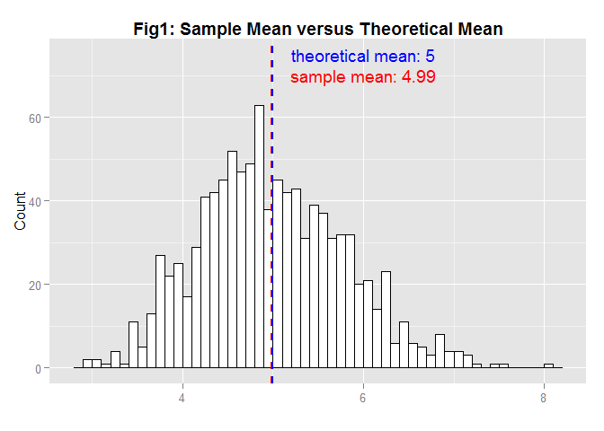

#  Exponential Distribution and Central Limit Theorem
CJ  
Thursday, January 08, 2015  

### Overview

In this project we investigate the exponential distribution and compare it with the Central Limit Theorem. We sample 40 exponentials and calculate their mean and standard deviation. After a thousand of simulations, we compare the average of such mean and standard deivation with its theoretical values, whose value should be both 1/lambda for the mean and the standard deviation. Finally, the distributions of the sample mean and standard deviation are normalized and compared with the standard normal. 

### Simulation 

Firstly, calucate the theoretical values of exponential mean and standard deviation. When `lambda`= 0.2, both mean and standard deviation equal to `5`.  


```r
lambda <-0.2 
# therotical values of sd and mean
tsd <- 1/lambda
tsd
tmn <- 1/lambda
tmn
```

```
## [1] 5
## [1] 5
```
 
Now, we generate 1000 averages of 40 random exponentials. In the chunk, a function called `exp.means` generate a vector of size ns contains the average of `ne` expontials.  


```r
lambda <-0.2 
n<-1000 # Number of simulations simulations
m<-40 # Number of  exponentials.

exp.means <- function(ne,ns,lambda,seed){
        
        set.seed(seed)
        mns=NULL
        for (i in 1:ns) mns=c(mns, mean(rexp(ne,lambda))) 
        data.frame(mns)
        
        
} 

mns <- exp.means(40,1000,lambda, 1000)
```

Plot the histogram of a thousand of simulated means and compare the average of these means with its theoretical value.


```r
library(ggplot2)

g <- ggplot(mns, aes(x=mns)) 

myhist<- function(g, bw,title) {        
        hist <- g+ geom_histogram(binwidth=bw, colour="black", fill="white")+
                ggtitle(title)+
                theme(plot.title = element_text(lineheight=.8, face="bold"))+
                xlab("")+
                ylab("Count")
        hist 
}

hist <- myhist(g, 0.1, title="Fig1: Sample Mean versus Theoretical Mean")

# add annotation 

smn <- mean(mns$mns)
notex <- 6
notey <- 70

hist+ geom_vline(aes(xintercept=smn),color="red", linetype="dashed", size=1)+
        annotate("text", x = notex, y = notey, 
                 label = paste("sample mean:", as.character(round(smn,2))), color="red")+
        geom_vline(aes(xintercept=tmn),color="blue", linetype="dashed", size=1)+
        annotate("text", x = notex, y = notey+5, 
                 label = paste("theoretical mean:",  as.character(round(tmn,2))), color="blue")
```

 


