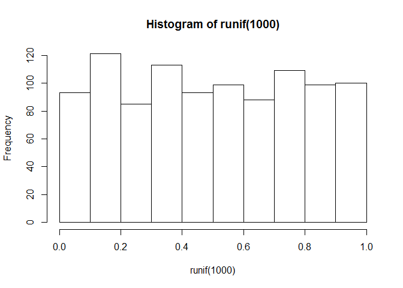
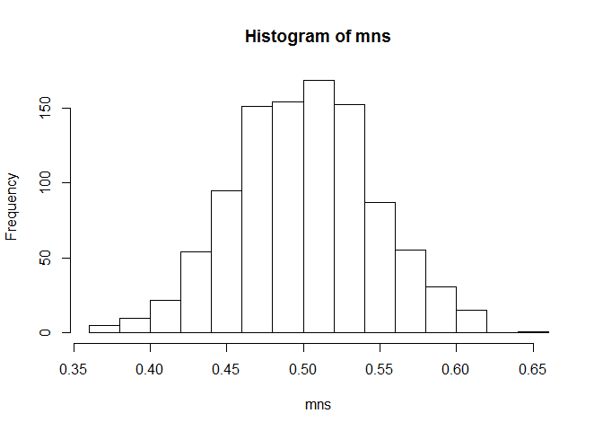

# README
CJ  
Sunday, January 18, 2015  

## part 1

In this project you will investigate the exponential distribution in R and compare it with the Central Limit Theorem. The exponential distribution can be simulated in R with rexp(n, lambda) where lambda is the rate parameter. The mean of exponential distribution is 1/lambda and the standard deviation is also 1/lambda. Set lambda = 0.2 for all of the simulations. You will investigate the distribution of averages of 40 exponentials. Note that you will need to do a thousand simulations.

I llustrate via simulation and associated explanatory text the properties of the distribution of the mean of 40 exponentials.  You should

1. Show the sample mean and compare it to the theoretical mean of the distribution.   

2. Show how variable the sample is (via variance) and compare it to the theoretical variance of the distribution.   


3. Show that the distribution is approximately normal.

In point 3, focus on the difference between the distribution of a large collection of random exponentials and the distribution of a large collection of averages of 40 exponentials. 

As a motivating example, compare the distribution of 1000 random uniforms.


```r
hist(runif(1000))
```

 

```r
mns = NULL
for (i in 1 : 1000) mns = c(mns, mean(runif(40)))
hist(mns)
```

 


**ADD SENTENCE HERE INDICATING WHAT ONE SHOULD NOTICE. Example: Notice how the the distribution of the 1000 generated random uniforms is XXXX compared to the distribution of the 100 averages of random uniforms? **

This exercise is asking you to use your knowledge of the theory given in class to relate the two distributions.  
Confused?  Try re-watching video lecture 07 for a starter on how to complete this project.

Sample Project Report Structure

Of course, there are multiple ways one could structure a report to address the requirements above.  However, the more clearly you pose and answer each question, the easier it will be for reviewers to clearly identify and evaluate your work. 

A sample set of headings that could be used to guide the creation of your report might be:

- Title (give an appropriate title) and Author Name   

- Overview: In a few (2-3) sentences explain what is going to be reported on.   

- Simulations: Include English explanations of the simulations you ran, with the accompanying     R code. Your explanations should make clear what the R code accomplishes.   

- Sample Mean versus Theoretical Mean: Include figures with titles. In the figures, highlight the means you are comparing. Include text that explains the figures and what is shown on them, and provides appropriate numbers.  

- Sample Variance versus Theoretical Variance: Include figures (output from R) with titles. Highlight the variances you are comparing. Include text that explains your understanding of the differences of the variances.

- Distribution: Via figures and text, explain how one can tell the distribution is approximately normal.


## Part 2

**Now in the second portion of the class, we're going to analyze the ToothGrowth data in the R datasets package.** 

1. Load the ToothGrowth data and perform some basic exploratory data analyses 

2. Provide a basic summary of the data.

3. Use confidence intervals and/or hypothesis tests to compare tooth growth by supp and dose. (Only use the techniques from class, even if there's other approaches worth considering)

4. State your conclusions and the assumptions needed for your conclusions. 

**Some criteria that you will be evaluated on**

- Did you  perform an exploratory data analysis of at least a single plot or table highlighting basic features of the data?

- Did the student perform some relevant confidence intervals and/or tests?
Were the results of the tests and/or intervals interpreted in the context of the problem correctly? 

- Did the student describe the assumptions needed for their conclusions?
